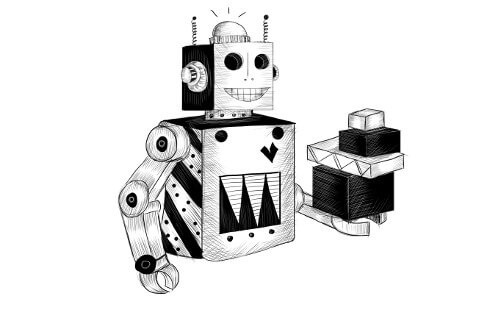

# automaton

Automaton is a program that performs a task in a virtual world. It automates mail-delivery by picking up and dropping off parcels in a village called Meadowfield.

The network of roads in the village forms a graph. A graph is a collection of points (places in the village) with lines between them (roads). This graph will be the world that our robot moves through.

Our robot will be moving around the village. There are parcels in various places, each addressed to some other place. The robot picks up parcels when it comes to them and delivers them when it arrives at their destinations.

The automaton must decide, at each point, where to go next. It has finished its task when all parcels have been delivered.

To be able to simulate this process, we must define a virtual world that can describe it. This model tells us where the robot is and where the parcels are. When the robot has decided to move somewhere, we need to update the model to reflect the new situation.

Minimum info needed:
1. Robot's current location 
2. Collection of undelivered parcels
3. Current location of undelivered parcel
4. Destination address